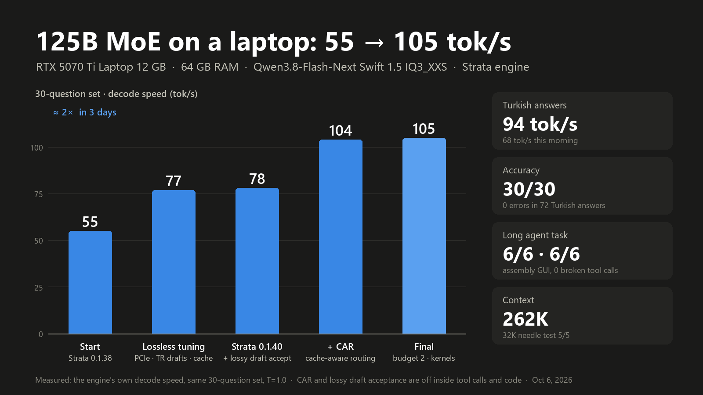
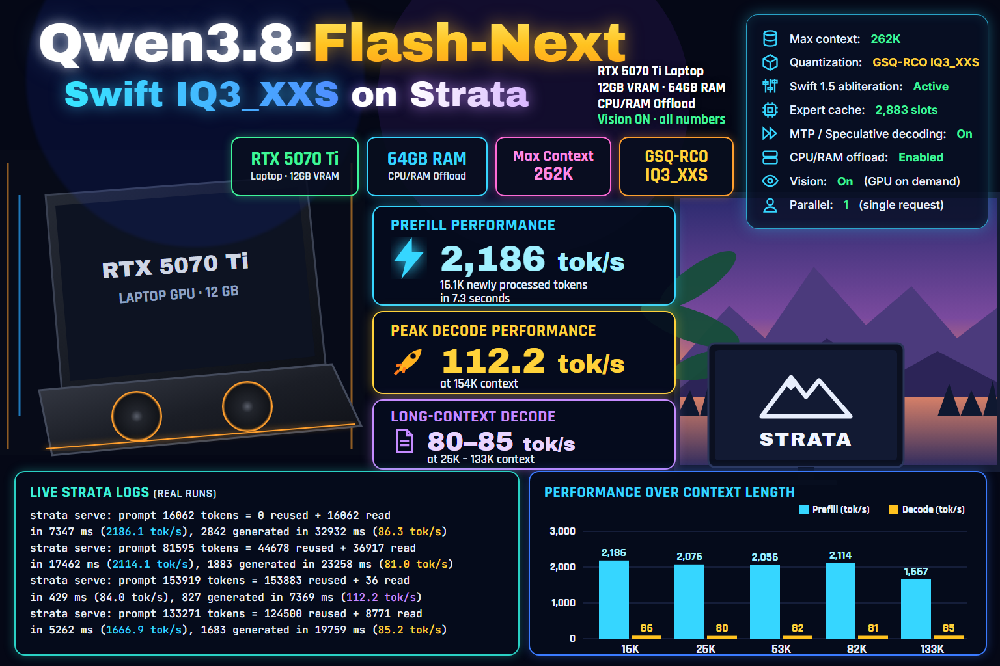

# Tuning Strata on a 12 GB laptop: 55 → 118 tok/s

This branch (`laptop-12gb`) is the exact engine and server I run every day on a gaming laptop. It is Strata
v0.1.41 plus some community PRs that are not merged upstream, plus a few local changes. Everything here was measured
on one machine over five days (4–8 October 2026). The 7–8 October work is in "Since 0.1.40.1" and "Since 0.1.40.3" below. Most of the local changes are opt-in switches, and with them off
the engine behaves like the code it sits on.





**The short version:** on the same 30-question set, generation went from **55 tok/s** (stock 0.1.38 release) to
**~105 tok/s**, and on 8 October to **~118 tok/s** (engine decode rate, temperature 1.0). Turkish chat answers went
from ~68 to ~94, then ~100 tok/s. The set still answers 30/30. A long agent task
(write, build and test an assembly GUI program in opencode) passed 6/6 checks twice with 0 broken tool calls.

The biggest step is CAR (cache-aware routing, from PR #1017). It is **lossy**: it swaps a missed expert for one that
is already on the GPU. Here it is limited by a per-token budget, and it is never used inside a tool call or a code
block. Its cost is measured below with a teacher-forced metric, so you can choose your own trade-off.

## Hardware and model

| | |
|---|---|
| Laptop | MSI Vector 16 HX AI |
| GPU | RTX 5070 Ti Laptop, **12 GB**, PCIe Gen5 x8 (the laptop wires it x8), sm_120 |
| CPU | Core Ultra 7 255HX (8 P + 12 E cores, no SMT, AVX2, no AVX-512) |
| RAM | 64 GB DDR5-5600, dual channel |
| OS | Windows 11, CUDA 13 runtime from the Strata venv |
| Model | Qwen3.8-Flash-Next, Swift 1.5 weights, abliterated (SC117), **IQ3_XXS** GGUF (2 parts, ~71 GB); 48 layers, 512 experts, top-10 |
| Context | 262144 (int8 KV, 20480 resident cells) |
| Sampling | temperature 1.0, top_p 0.95, top_k 20 (Qwen's thinking settings) |

The expert cache holds about 13% of the experts. Everything else runs from the CPU pool or comes over PCIe. Before
CAR the bottleneck was the CPU experts. After CAR it is the GPU: a verify window is about 28 ms for about 2.7 tokens.
About half of that is the GPU waiting for the host. Attention, the LM head, the projections and the VRAM experts
make up the rest.

## What is on this branch

`git log --reverse v0.1.40.3..laptop-12gb`. Commits by other people are cherry-picked unchanged. Flattened PR merges
carry the PR author as the git author. Since 0.1.40.1 these went upstream and are no longer separate commits here:
#1172 (tool call recovery), #949 (`--pool-tasks`), #1125, #1316 / #1252, the draft policy log and #1053
(`"reasoning_close_retry": true`, which replaces my local #1053).

| Commit | What | From | Switch |
|---|---|---|---|
| `serve: local patches ported to 0.1.40` | the wrap-up tools sentence, a hidden wrap-up, a thinking budget per reasoning effort | local | `reasoning_budget_by_effort`, `hide_reasoning_wrap_up` |
| `serve: opt-in stop for a reply that loops a 2-16 token pattern` | like #606, but for a short pattern instead of one token | local | `"pattern_stop_tokens": 512` in the config |
| `serve: a tool call written <function= NAME> ...` | a space after `=` no longer turns a call into text | PR #1430 (Ron Forrester) | always on |
| `serve (local): a reply that ends inside a tool call ...` | a reply that ends in the middle of a tool call, or right after its thinking with nothing written, has its stop token dropped and goes on once | local, after issue #1431 | on; `STRATA_STOP_MID_CALL=0` turns it off |
| `Prepare local prompt reuse ...` | the chat history is not BPE-encoded again on every request (~40 ms per 20K tokens of history here) | PR #1455 (W1nge, after #567) | always on |
| `prefix snapshots on disk` | a new chat restores its prompt prefix from disk instead of reading it again | PR #960 (konijiwa110) | `--prefix-cache-dir`, `--prefix-cache-disk-mib` |
| `typ3: lossy draft acceptance` | accept an MTP draft when it is within a margin of the target's top token | local | `STRATA_TYPICAL_MARGIN`, `STRATA_TYPICAL_THINK` / `_ANSWER` |
| `CAR (PR #1017 engine part) + ... scope` | cache-aware routing, plus a local scope rule (never inside `<tool_call>` or a code fence) | PR #1017 (dhoard) + local | `STRATA_CAR_THRESHOLD`, `_BUDGET`, `_FREE_RATIO`, `_SCOPE` |
| `CAR: STRATA_CAR_LAYERS` | substitute only inside a layer range | local | `STRATA_CAR_LAYERS` (not used in the end) |
| `prefill: gather experts in groups ...` | grouped expert gather on short prompts | PR #1107 (Breno Perucchi) | always on |
| `OPUS-KERNEL-...` | faster hyper-connection reads on CUDA, bit-identical | imanu86/Strata-2080Ti | `STRATA_HC_UP_FAST=1` (only UP; `HC_DOWN_W4` was slower here) |
| `pool: --host-core last on a hybrid CPU` | moves the host thread off the first P-core, which takes the GPU's interrupts on Windows | local, after PR #1166's idea (Hardin22) | `STRATA_HOST_CORE=last` / `--host-core last` |
| `loop guard: the lossy rules ... are off while the reply repeats` | lossy acceptance and CAR are off while the last 48 tokens repeat a 1-16 token pattern | local | on; `STRATA_LOOP_GUARD=0` turns it off |
| `cpu pool: guided self-scheduling for the native phases ...` | a phase's rows in shrinking ranges (large first, small last), so a slow E-core cannot hold the phase; plus a phase profiler | local | `STRATA_POOL_GUIDED=1`, `STRATA_POOL_GUIDED_MIN=32`; `STRATA_POOL_PROFILE=1` |
| `prompt attention: STRATA_PROMPT_ATTN_IMMA=1 ...` | the int8-KV prompt attention on INT8 tensor cores, closer to FP32 | PR #1367 (sergiywith) | `STRATA_PROMPT_ATTN_IMMA=1` |
| `prefill: opt-in STRATA_HC_UPMIX=1 on CUDA ...` | the hyper-connection up projection with its mix as the epilogue | PR #1370 (sergiywith) | `STRATA_HC_UPMIX=1` |
| `prefill: quantize each token's MoE input once ...` | the same q8_1 bytes, quantized once per token instead of once per expert | PR #1368 (sergiywith) | always on |
| `prefill: STRATA_PREFILL_CPU_SHARE=auto times layers ...` | the CPU share is used only on the layers where it measures faster | PR #1379 (sergiywith) | `STRATA_PREFILL_CPU_SHARE=auto` |
| `cpu: add bit-exact AVX2 singleton expert rows` | single-token IQ2/IQ3 gate/up rows in ggml's own order, bit-exact | PR #1415 (InB4DevOps) | `STRATA_CPU_IQ_ALL_EXACT1=1` |

Experiments I measured and rejected (a PDL / MMVQW port, CAR research switches) are not published as branches any
more; their results are in "What did not help here".

## The live configuration

This is the Strata config the server runs (`strata serve` reads it). Paths are shortened; my MCP servers are left out.

```json
{
  "exe": "<build>/strata.exe",
  "args": [
    "--pack", "<packs>/sc117-swift-iq3_xxs",
    "--native", "<model>/Swift-...-abliterated-IQ3_XXS-00001-of-00002.gguf",
    "--ple-gguf", "<model>/Swift-...-abliterated-IQ3_XXS-00001-of-00002.gguf",
    "--expert-profile", "data/expert-profile.bin",
    "--expert-cache", "auto",
    "--pool-workers", "13",
    "--pool-tasks", "192",
    "--kv-resident", "20480",
    "--kv", "int8",
    "--max-context", "262144",
    "--vram-reserve-mib", "300",
    "--prefill", "auto",
    "--pcie-frac", "0.2",
    "--spec", "4",
    "--spec-min-p", "0.5",
    "--mtp", "<data>/mtp/rt-tr",
    "--adapt-every", "1", "--adapt-swaps", "160", "--adapt-decay", "0.97",
    "--prefix-cache-dir", "<data>/prefix-cache", "--prefix-cache-disk-mib", "8192"
  ],
  "env": {
    "STRATA_ADAPT_NOWAIT": "1",
    "STRATA_PF_FUSED": "1",
    "STRATA_PF_FUSED_TILE": "128",
    "STRATA_TYPICAL_MARGIN": "0.5",
    "STRATA_TYPICAL_ANSWER": "1",
    "STRATA_CAR_THRESHOLD": "0.35",
    "STRATA_CAR_BUDGET": "2",
    "STRATA_CAR_FREE_RATIO": "0.8",
    "STRATA_CAR_SCOPE": "answer",
    "STRATA_HC_UP_FAST": "1",
    "STRATA_HOST_CORE": "last",
    "STRATA_ATTN_LANECELL": "1",
    "STRATA_IQ_MT_MIN": "1",
    "STRATA_POOL_GUIDED": "1",
    "STRATA_POOL_GUIDED_MIN": "32",
    "STRATA_PROMPT_ATTN_IMMA": "1",
    "STRATA_HC_UPMIX": "1",
    "STRATA_PREFILL_CPU_SHARE": "auto",
    "STRATA_PREFILL_STREAM_MIN": "2048",
    "STRATA_CPU_IQ_ALL_EXACT1": "1",
    "STRATA_THINK_BAN": "13784,13428,77264,85152,50821,32645,88842,37201"
  },
  "tool_call_recovery": true,
  "fit_max_tokens": true,
  "pattern_stop_tokens": 512,
  "sampling": { "temperature": 1.0, "top_p": 0.95, "top_k": 20, "min_p": 0.0 },
  "reasoning_budget_tokens": 6144,
  "reasoning_budget_by_effort": { "low": 4096, "medium": 8192, "high": 12288, "xhigh": 12288 },
  "effort_position": "start",
  "reasoning_close_retry": true,
  "hide_reasoning_wrap_up": true,
  "reasoning_loop_recovery": "wrap",
  "vram_elastic": true,
  "vision": { "exe": "<strata>/engine/strata-vision.exe", "mmproj": "<mmproj BF16>", "gpu": "on_demand" }
}
```

What each choice does (all of it measured, see the next section):

- `--mtp .../rt-tr` is the stock MTP head with a **Turkish draft vocabulary**. The stock `draft_vocab.bin` left
  out 28% of the tokens in real Turkish answers. Adding the Turkish-letter tokens and the common ASCII tokens gave
  109,112 ids. Turkish draft acceptance went from 55% to 69%, and Turkish generation rose 15%. English and code did
  not change.
- `--pcie-frac 0.2` replaces the boot-time PCIe probe. The probe sometimes measured 15 GB/s, picked 0.42–0.55, and
  cost ~10%. Fixing the value removed that start-to-start spread.
- `--adapt-every 1 --adapt-swaps 160 --adapt-decay 0.97` + `STRATA_ADAPT_NOWAIT=1`: a busier adaptive expert
  tier that does not wait for its copies (#463 / #764 / #906). Turkish +6.5%, agent tasks +8%.
- `STRATA_TYPICAL_*`: lossy draft acceptance with margin 0.5, in answer text only. Tool calls and code fences stay
  strict.
- `STRATA_CAR_*`: CAR with threshold 0.35. Each token may substitute **at most 2** experts (the budget). A
  substitute whose router probability is ≥ 0.8 of the missed expert's is free and does not count toward the budget.
  The scope is thinking plus answer text, never `<tool_call>` and never inside a code fence.
- `STRATA_HC_UP_FAST`, `STRATA_ATTN_LANECELL`, `STRATA_HOST_CORE=last`: small lossless kernel and placement wins
  (below).
- `fit_max_tokens`: opencode compacts a chat at its input limit minus its reserve (~245K here), but it still asks
  for ~32K output tokens on every request. Between ~230K and ~245K every request got a 400 error until this was set.
  Now the server shortens max_tokens to the room that is left.
- `pattern_stop_tokens` and the loop guard: see "Loops in the answer text" below.
- `effort_position: start` (the template's own place). `end` kept the cache when the effort changed (21.5 s → 5.0 s
  on a 38K document), but with a low or medium effort it put a ~34-token system turn at the end of every request, and
  that turn was read through the verify windows each time: 270–470 ms per request. `start` reads 4 tokens there
  (27–42 ms). The cost is a full re-read when you change the effort in the middle of a chat.
- `STRATA_PROMPT_ATTN_IMMA`, `STRATA_HC_UPMIX`, `STRATA_PREFILL_CPU_SHARE=auto`, `STRATA_PREFILL_STREAM_MIN=2048`:
  faster prompt reads (see "Since 0.1.40.1").
- `STRATA_CPU_IQ_ALL_EXACT1=1`: the bit-exact single-token CPU rows of #1415.

## Measurements

The method is the same everywhere unless a row says otherwise. "30 questions" is a fixed set of 30 short questions
with known answers (generation tok/s as the engine reports it). "Turkish" is 6 fixed Turkish prompts. Each arm runs
2 rounds or more, in mixed order (A, B, B, A), and the model reloads every round. A Turkish character checker
(`tr-check`) looks for missing accents, wrong vowel harmony and foreign script in every Turkish answer. I ran
nothing else on the machine during a measurement: even a `git fetch` moved the numbers by ~4%.

### The path, step by step (30 questions, generation tok/s)

| Step | tok/s | Answers |
|---|---|---|
| Strata 0.1.38 release, defaults | ~55 | 30/30 |
| Lossless settings: `--pcie-frac 0.2`, Turkish draft vocabulary, busier adaptive tier + NOWAIT, own build with #783 + #949 | ~77 | 30/30 |
| Strata 0.1.40 + #949 + #960 + lossy draft acceptance | 78.0 | 59/60 |
| + CAR 0.35, thinking only, no budget | 104.5 | 60/60 |
| Final: CAR budget 2 + free ratio 0.8, scope answer, lossless kernels | ~105 (101–107 across runs) | 30/30 every run |

The final step trades a little of CAR's raw speed for quality. The budget sweep is below.

### CAR (PR #1017) on this laptop

0.1.40, thinking-only scope, no budget (`car40-ab`):

| | CAR off | CAR 0.35 | |
|---|---|---|---|
| Turkish | 69.3 | 78.4 | +13% |
| 30 questions | 78.0 | 104.5 | +34% |
| expression-calculator agent task | 74.4 | 78.2 | +5% |
| expert hit rate in decode | 57–60% | 88–91% | |

On this machine CAR substituted 73–75% of the misses (the PR's AMD measurement: 31%).

**Unbudgeted CAR broke long agent runs.** The long assembly task passed only 1/6 checks, twice. The model wrote its
code or its `<tool_call>` inside the thinking and then stopped without `</think>` (the pattern of issue #1053). A
per-token budget, the scope rule and the server-side #1053 close fixed it (see the heavy tests below).

**Choosing the budget with a teacher-forced metric.** Greedy prefix agreement was useless here: the engine
disagrees with itself 16.5% of the time because CPU and GPU expert rounding differ. So I read a fixed 3768-token
Turkish text as a prompt through the verify windows (`--short-read 100000`, `STRATA_CAR_ON_PROMPT=1` on the
research branch), logged every position's log-probability (`STRATA_LOGPOS`), and compared each arm to CAR off.
The measurement is exactly repeatable: a rerun of the reference differs by 0.00%.

| threshold / budget / free ratio | Turkish tok/s | 30 q tok/s | 30 q | top-1 same as CAR off | positions with \|Δlogp\| > 1 | perplexity |
|---|---|---|---|---|---|---|
| CAR off | 74.4 | 80.1 | 30/30 | 100% | 0% | 5.298 |
| 0.35 / 3 / 0.8 | 90.6 | 105.8 | 30/30 | 81.0% | 21.1% | +26.1% |
| 0.50 / 3 / 0.8 | 88.5 | 99.6 | 30/30 | 79.7% | 21.7% | +58.9% |
| **0.35 / 2 / 0.8 (live)** | **91.2** | **101.3** | 30/30 | **85.0%** | **17.2%** | **+12.1%** |
| 0.35 / 3 / off | 87.9 | 100.0 | 29/30 | 79.4% | 22.3% | +36.5% |
| 0.50 / 2 / off | 82.4 | 93.2 | 30/30 | 87.9% | 13.3% | +5.6% |
| 0.35 / 1 / off | 76.6 | 86.0 | 30/30 | 88.6% | 12.0% | +20.7% |

The perplexity of one long text jumps around: a single different expert choice changes everything after it. The
robust measures are top-1 agreement and the |Δlogp| > 1 rate. Both follow the budget monotonically: budget 3 gives
79–81% agreement, budget 2 gives 85–88% and budget 1 gives 89%. Raising the threshold to 0.5 costs speed and does
not clearly buy quality. The free ratio buys speed (Turkish +3%, 30 questions +6%). The Turkish speeds in this table
are about 3% lower than usual because of the measurement switches. The arms are still comparable.

This cost does not show up in the 30 questions or in tr-check. It is real, and it is the reason the budget is 2.

### CAR and lossy acceptance in the answer text ("both")

Both used to run in the thinking only. Then I measured them in the answer text, still strict in tool calls and code.
Each arm had 36 Turkish answers + 30 questions:

| arm | Turkish tok/s | tr-check flags | 30 q | 30 q tok/s |
|---|---|---|---|---|
| CAR + lossy acceptance in thinking only | 79.7 | 0/36 | 30/30 | 104.0 |
| + CAR in answer text | 87.6 (+10%) | 0/36 | 30/30 | 101.4 |
| + lossy acceptance in answer text | 81.9 (+3%) | 0/36 | 30/30 | 101.7 |
| **both** | **94.5 (+18.6%)** | 0/36 | 30/30 | 106.8 |

A second, independent load gave Turkish 93.6 tok/s, tr-check 0/36 (0/72 in total), 30/30 at 106.8 and the
short assembly agent task 2/2, with 0 broken tool calls.

### Heavy tests on the final configuration

opencode agent tasks (`agent-eval.py`), the needle test, 32K context:

| test | result | time | generation tok/s | tool calls |
|---|---|---|---|---|
| asmsum (assembly: print 12+30, build, run) ×2 | 4/4, 4/4 | 51 s, 46 s | 85.0 / 88.1 | 7, 0 broken |
| exprcalc (expression calculator, 20 hidden tests) ×2 | 3/3 (20/20) ×2 | 103 s, 99 s | 84.9 / 81.2 | 18, 0 broken |
| asmcalc (long: assembly GUI calculator) ×2 | 6/6, 6/6 | 1223 s, 1414 s (60 steps, 82K–108K tokens) | 81.1 / 83.5 | 120, 0 broken |
| needle in 32K (32,328 tokens) | 5/5, order correct | 16.2 s | – | – |

The #1053 close fired 8 times in these runs, mostly in the ~140 turns of the two long tasks, and every task still
passed. Lossy speed-ups seem to make "stopped inside the thinking" more likely, and that server-side close is what
catches it. If you run CAR, run it with that patch.

### Small lossless wins (measured with internal stage timings)

End-to-end tok/s moves by ~4% from round to round, so for small changes I compared stage times from
`STRATA_DECODE_TIMING=1` and `STRATA_VERIFY_PROFILE=1` (ms per verify window):

| change | measure | before | after |
|---|---|---|---|
| `STRATA_HC_UP_FAST=1` (imanu86) | hc0 up stage | 0.865–0.882 | 0.770–0.778 ms |
| `STRATA_HC_DOWN_W4=1` (imanu86) | hc0 down stage | 1.06–1.08 | 1.55 ms (**slower** here, not used) |
| `STRATA_HOST_CORE=last` (local, #1166's idea) | host time per window / ms per token | 9.82–9.85 / 10.41 | 8.94–9.26 / 10.13 (−2.7%) |
| `STRATA_ATTN_LANECELL=1` (in 0.1.40's QSA kernel) | attention stage | 0.574–0.585 | 0.468–0.485 ms (−18%) |
| PR #1107 + #1125 | short prompt read / CPU activation prep | 363.5 tok/s / 0.34 ms | 373.5 tok/s / 0.22 ms |
| `STRATA_IQ_MT_MIN=1` (already in 0.1.40, opt-in) | host time per window / ms per token | 9.56 / 9.93 | 8.60 / 9.50 (−4.3%; generation 100.7 → 105.3 tok/s) |

`STRATA_IQ_MT_MIN=1` makes the CPU pool use Strata's multi-token AVX-2 kernels for single-token expert rows too.
On one 255HX P-core, a single-token expert (gate/up + down) took 0.417 → 0.270 ms for IQ3_XXS, 0.505 → 0.223 ms
for IQ3_S and 0.344 → 0.233 ms for IQ2_S. The E-cores are mixed, from −28% to +15%. DETAILS.md measured −1..−3% for
it on an AVX-512 Ryzen; this CPU has no AVX-512. It won in both run orders.

All of them are bit-identical or pure thread placement, and every round answered 30/30. On this CPU the P-cores
are logical processors 0, 1, 6, 7, 8, 9, 18 and 19. Windows delivers the GPU's interrupts to LP 0, so
`--host-core last` puts the host thread on LP 1 and gives LP 0 to a pool worker.

### Since 0.1.40.1 (7–8 October)

Moving my commits onto **v0.1.40.2** (which turned the interleaved q8_1 projections, `STRATA_MMVQ_IL`, on by default)
gave **−4.0% ms per token** in both run orders (10.29 → 9.87), with the 47-text quality set inside run-to-run noise
(KL 0.0326 against a 0.0278 noise floor). 0.1.40.3 measured the same as 0.1.40.2 (9.29 vs 9.24 ms per token).

| change | measure | before | after |
|---|---|---|---|
| #1415, `STRATA_CPU_IQ_ALL_EXACT1=1` (bit-exact) | host time per window / ms per token | 8.75 / 9.36 | 8.16 / 9.15 (−2.2%) |
| #1367 + #1370 (IMMA + UPMIX) | prompt read, 7.9K / 23.6K tokens | 1,973 / 2,125 tok/s | 2,115 / 2,257 (+7% / +6%) |
| + #1379 `STRATA_PREFILL_CPU_SHARE=auto` | prompt read, 347 / 657 tokens | 1.39 / 1.64 s | 1.03 / 1.23 s (+34%) |
| + `STRATA_PREFILL_STREAM_MIN=2048` | prompt read, 1,174 tokens | 1.86 s | 1.56 s (+19%) |
| `effort_position: start` | a 300 / 600 / 1000-token tool result after 16K of history (client time) | 1.17–1.35 / 1.31–1.37 / 1.51–1.63 s | 0.85–0.88 / 1.01–1.06 / 1.25–1.28 s |

Short prompt reads on this laptop are bound by PCIe: a 250-token read moves nearly all of the routed experts and
took 1.4 s. The CPU share computes the rarely routed ones from RAM instead. With 3072 as the limit (#1414) the 2-3K
token reads were 20% slower here (PCIe 5.0 x8); 2048 is right for this machine. The CPU share changes the last bits
(KL +0.01 over the noise floor in a prefill-path teacher-forced test), with no perplexity change.

### Since 0.1.40.3 (8 October)

The engine and server are now **v0.1.41** with all of the changes above merged in. On the same Turkish set, 0.1.41
measured 10.55 / 10.62 ms per token against 10.37 / 10.48 before (within run-to-run noise).

| change | measure | before | after |
|---|---|---|---|
| #1517 (the tier's evictions reach the device table) | `STRATA_ADAPT_CHECKRES=1`, Turkish set: windows with a stale residency table | 180 of 512 (10,871 entries), 1 layer-window computed from a stale activation | 0 / 0 |
| #1525 (fused prefill kernels, same bits) | prompt read, 8K / 24K tokens | 2,251 / 2,329 tok/s | 2,275 / 2,341 (+0.9% / +0.7%) |
| live-end checkpoint (#1537) + a reply's own token ids on the next turn + drained tokens kept (#1536) | a tool turn after a thinking-budget wrap-up: tokens read again | 1,379–3,635 (from the turn's start) | 583 / 1,770 (from where the texts differ) |
| `"vision": {"gpu": "on_demand"}` + `vram_elastic` (local) | vision enabled: expert cache / ms per token / a new image | 2,251 slots / 8.91 / 1.4 s (encoder resident) | 2,883 slots / 8.26 / 3.3 s |
| `STRATA_THINK_BAN` (NoWait, arXiv 2506.08343; **changes the text**) | 30 questions, effort medium, 2 runs: tokens / wall time | 7,617 / 78.9 s | 6,694 / 72.0 s (−12% / −9%), 30/30 both |
| `reasoning_loop_recovery: "wrap"` (local mode) | the detector run offline on 2,259 real opencode turns | — | 32 of its 33 triggers are real loops; 4.2% of all thinking would be cut |

Before these, the logs showed ~14% of all prompt-read time going to reading a reply again that the engine still
held: a thinking-budget wrap-up the client's history does not carry, a few tokens the engine generated past a STOP,
and pieces the model wrote that BPE would merge (Turkish letters, code). `STRATA_PROMPT_DUMP=<file>` (server) writes
each request's ids and the engine's tokens, which is how this was found.

NoWait adds a −100 logit bias to Wait / Hmm / Actually / Alternatively (with and without a leading space) while the
reply is inside its thinking and not writing a call. On my opencode history 92% of the model's text is thinking and
15% of the thinking is paragraphs that open with those words. The loop mode closes a looping thinking with the
budget's hidden wrap-up instead of ending the reply, so an agent still gets its call.

Same hour, same tests, temperature 1.0, engine decode rate (the log's `generated ... tok/s`, request average):

| build | Turkish set | 30 questions | answers |
|---|---|---|---|
| the 7 October morning build | 97.3 / 94.8 tok/s | 107.9 / 107.0 tok/s | 30/30, 30/30 |
| this branch (0.1.41) | 98.8 / 101.2 tok/s (+4%) | 119.5 / 118.2 tok/s (+11%) | 30/30, 29/30 (a question this set misses 7 times in 277) |

### Server: 0.1.40.1 + #1172 + local patches

The engine and the server are the same release (0.1.40.1). The server adds #1172 (tool call recovery, opt-in),
a thinking budget per reasoning effort, a hidden wrap-up, and the local #1053 close. Upstream's
`test_reasoning_loop_recovery` and `test_reasoning_rescue` pin the "one pass when it stops in the thinking"
behaviour, so those two modules turn #1053 off in `setUpModule`. #1053 has its own tests in `test_server.py`
(`StoppingThinker`, `StopInsideThinking`). Result: 472 tests OK (8 skipped: they need a GPU).

### Loops in the answer text

Once, after the tuning, an answer ended in "ÇtaÇtaÇta..." and kept going for 12,290 tokens (108 tok/s; the suffix
drafter's acceptance was 7651 of 7656). "Ç" and "ta" are two tokens, so #606, which ends a reply that repeats one
token 256 times, never fired. #728 only looks at the thinking.

The lossy margin rule makes such a loop absorbing. It keeps a draft whose probability is at least half the top
token's. Say the loop token has p = 0.4 and the way out has p = 0.6. Exact sampling leaves the loop 60% of the time
at every step. The margin rule keeps the loop token every time (0.4 ≥ 0.5 × 0.6).

Two changes on this branch:

- **Engine loop guard:** while the last 48 tokens repeat a pattern of 1-16 tokens, lossy acceptance and CAR are
  off and the window is computed exactly.
- **Server pattern stop** (opt-in, `"pattern_stop_tokens": N`): a pattern of 2-16 tokens that repeats for N tokens
  in a row ends the reply as "length", the way #606 does for one token. It is off by default because two alternating
  tokens can be real content, and upstream's tests rely on that.

| | without the guard | with the guard |
|---|---|---|
| Turkish tok/s | 86.5 | 88.1 |
| 30 questions tok/s | 106.2 | 104.8 |
| 30 questions | 30/30 | 30/30 |
| times the guard engaged on normal text | – | 0 |
| loop probe (asks for 80-150 repetitions, ×9): runaways | 2/9 | 2/9 |

The speed differences are noise. The probe's runaways are the model losing count ("ahahah..."), and #606 ends them
in both arms. So the guard did not change the probe. It is a safeguard for the absorbing case, and the server stop
is the hard limit.

### The CPU pool's tail on a hybrid CPU

The CPU expert pool runs each layer in two phases: gate/up rows, then down rows. Each phase splits the rows of the
layer's CPU experts into tasks that 13 workers and the host claim. `STRATA_POOL_PROFILE=1` times every phase.

| per phase | equal split (192 tasks) |
|---|---|
| wall time | 136-169 µs |
| wake latency | 0.7-1.0 µs |
| parking waits | 0.5-0.8 µs |
| threads busy | 75-82% |
| first to last thread finishing | 27-43 µs |

Waking and parking cost nothing; the loss is the tail. A slower E-core that claims one of the last equal ranges
holds the whole phase. There are about 82 phases per verify window. More, smaller equal tasks do not fix it: 384
tasks shortened the tail but added work (locality), and 768 was slower.

Guided self-scheduling (`STRATA_POOL_GUIDED=1`) hands out ranges of remaining rows / (2 × threads), never below 32
rows. The first ranges are large and the last are small. Every row is still computed once, the same way.

| | equal split | guided, min 32 |
|---|---|---|
| phase wall, round 1 / 2 | 169 / 136 µs | 135 / 121 µs |
| threads busy | 75 / 82% | 83 / 87% |
| host time per window | 11.51 / 9.32 ms | 9.33 / 8.34 ms |
| window time | 29.37 / 27.24 ms | 27.31 / 26.32 ms |
| 30 questions | 30/30 | 30/30 |

### Stale draft-window costs (#1252, #1316)

The draft policy learns how long each window size takes and picks sizes by expected tokens per millisecond. A size
that is measured at a slow moment can stay "expensive" for the rest of the process (issue #1252). With
`STRATA_POLICY_LOG=1` I watched it in one process: two code-copy requests, a 26K prompt, the agent tasks, Turkish
answers, another 26K prompt, then two more copies. The 5-token window kept its single 76.6 ms sample for 5,400
rounds, where its neighbours suggest about 46 ms. The copies got slower from start to end of the session:

| code copy, tok/s | first two | last two |
|---|---|---|
| without #1316 | 102.5 / 102.1 | 99.0 / 99.6 |
| with #1316 | 98.2 / 99.3 | 100.7 / 101.3 |

With #1316 the late-session drop is gone. The copied file grew a little with #1316 itself, so the two runs are not
the same text. The gain is about 2-3% at most and only on copy-heavy work. It is lossless, so it is on.

## What did not help here (measured and rejected)

| idea | result |
|---|---|
| `--spec 5` / `--spec 6` after CAR | Turkish −11% (spec 5), lower acceptance (spec 6) |
| `--adapt-swaps 256 / 320` | no clear change |
| #1548 `STRATA_PCIE_BALANCE=1` (per-layer PCIe count, `--pcie-frac` dropped) | 5–9% slower than the hand-tuned `--pcie-frac 0.2` |
| CAR per expert ("union" rule: substitute all of an expert's rows or none) | quality the same, speed the same (−12% CPU experts did not shorten the window) |
| moving cache slots between layers (MoE-CORE) | measured headroom 0.5 points of missed demand: the profile already sizes the layers well |
| SEAL steering vector (arXiv 2504.07986) through the control-vector path | −10% thinking at a safe scale, no better than NoWait; stronger scales lost questions |
| `--vram-reserve-mib 300` instead of 700 with on-demand vision | +8% cache slots, no measurable speed change |
| `--lookup-chain 2 / 4` | agent copy turns −6..−7% (the target case) |
| `--pcie-frac 0.35` (issue #1216's value on the same GPU) | neutral: the CPU wait drops (5 → 1 ms) but the GPU then waits on PCIe instead (3 → 6.5 ms) |
| `STRATA_PREFILL_EQUAL=1` (#693) | +2.8% at 18.5K, −1.1% at 29.6K, nothing at 11K |
| `STRATA_IQ256_GATHER` forced 0 or 1 | the engine's automatic per-core choice (gather on P-cores, not on E-cores) beats both |
| PR #904 PDL, ported to 0.1.40 | parity passes, window time unchanged (27.77 vs 27.80–28.19 ms) |
| architectds MMVQW | bit-exact, but never engages: this model's LM head takes the large-K path |
| `STRATA_MTP_CHAIN` (a local graph for the MTP round, after architectds) | no gain: drafting time is GPU work |
| `STRATA_PLE_FIRST` (local) | no difference |
| #1181 + #733 pool pipeline + IQ4_NL scale cache | −0.3%, noise |
| `STRATA_FETCH_ADMIT` (AdrianBM96) | after CAR only 1.5% of the routed experts come over PCIe |
| a community Swift 1.5 abliterated **IQ3_S** (ISTA's IQ3_S type map, but the experts quantized without GSQ) | worse than the GSQ-RCO IQ3_XXS on all three texts, and slower: perplexity +14% Turkish (Wikipedia), +42% English docs, +19% C++; −12% speed; 1.7-2.3 GB of RAM left free instead of 8.2-8.8 |
| CAR budget by confidence (an oracle ceiling: a bigger budget where the reference top-1 probability is ≥ 0.7) | at b3's substitution rate it kept b2's quality (top-1 84.3% vs 81.0%), but another oracle arm scored 78.5%: single-text noise is about ±3 points, so the ceiling is too small to build the real version |
| PR #1281 Gumbel-max coupled drafts (`STRATA_SPEC_GUMBEL=1`) | acceptance +3-4 points, but fewer tokens per window: −2.5% with the margin rule, −8.3% in place of it |
| expert-similarity substitution (SERE / BuddyMoE) | this model's 512 experts are nearly orthogonal (mean cosine 0.002–0.019), so no expert can stand in for another |
| skip the missed expert instead of substituting | perplexity +147–165% (substitution: +12–26%) |
| skip + renormalise the kept weights | +43.6%, still behind substitution |
| `STRATA_POOL_SPIN_US=100` (#921) | +6%, but the engine hung for 60 s once |
| `--kv q4_0`, `--kv k8v4` | quality risk / about 1% hit rate, and #1135 |
| `--prefill auto:16384` | 12 GB fits only 8960; mixed ±4% |
| Windows large pages | 40 GB of contiguous 2 MB pages are rarely free; the effect is small |
| #1414 + #1416 (CPU share up to 3072 tokens, activations quantized on the GPU) | 2-3K token reads 20% slower at 3072 on PCIe 5.0 x8; below 1K within noise |
| #1465 (HC norm) and #1469 (`__restrict__`, no PDL prefetch) | GPU time per window unchanged (13.04 / 13.23 / 13.15 ms) |
| the gfx1151 exact speed switches on CUDA (`MMVF_ROWS`, `LFUSE`, `GDN_SPLIT`, `QFUSE`, `VERIFY_QDEDUP`, `PLE_BATCH`) | −1.1% window time, noise |
| `STRATA_HC_Q8=1` with a load-time Q8_0 copy of the BF16 hc rows | GPU −5%, but the 0.63 GiB copy shrinks the expert cache (3099 → 2645 slots) and the host loses it all: +0.7% |
| next-layer expert prefetch (the next layer's router on this layer's input, measured, not built) | it catches 59% / 74% of the misses (top 10 / 16 per token), but ~640 misses of 2.1 MB per window are ~1.3 GB, twice what PCIe moves in a window |

MTP ceiling (`STRATA_SPEC_HIST`, research branch): 3.02 tokens per window now. A perfect drafter at the same window
sizes would give 3.60, so training a better MTP head can add at most +19%.

## Reproducing

1. Build this branch the normal way (CUDA 13, sm_120 here) and point the config's `exe` at the build.
2. Start from the config above. If you only want the lossless part, drop the `STRATA_CAR_*` and
   `STRATA_TYPICAL_*` lines. CAR is off when `STRATA_CAR_THRESHOLD` is not set.
3. To measure CAR's cost on your own text, add `--short-read 100000`, `STRATA_LOGPOS=<file.tsv>` and
   `STRATA_LOGPOS_TOPK=64` to the config, send the text once as a prompt, and compare the TSV with a CAR-off run
   (KL, top-1 agreement and the |Δlogp| > 1 rate). Run the CAR-off arm twice: the difference between those two is
   the noise floor.
4. For small changes, use `STRATA_DECODE_TIMING=1` and `STRATA_VERIFY_PROFILE=1` and compare stage times, not
   end-to-end tok/s. Turn the profile off when you measure PDL, because its event nodes break the PDL chain.

Different hardware will need different numbers. The PCIe split, the pool size and the CAR budget all depend on how
much of the model fits in VRAM and how fast your CPU and PCIe are.

## Credits

Strata is by Niko1221 and its contributors. The parts on this branch that are not mine come from:
konijiwa110 (#960), dhoard (#1017, CAR), Breno Perucchi (#1107), Hardin22 (the #1166 host-core idea),
imanu86 (the HC kernels, imanu86/Strata-2080Ti), sergiywith (#1367, #1368, #1370, #1379), InB4DevOps (#1415),
Ron Forrester (#1430) and W1nge (#1455). `STRATA_ATTN_LANECELL` is an opt-in switch that already exists
in 0.1.40's QSA attention kernel.